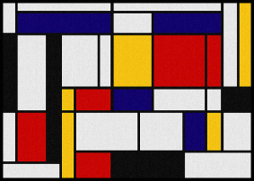
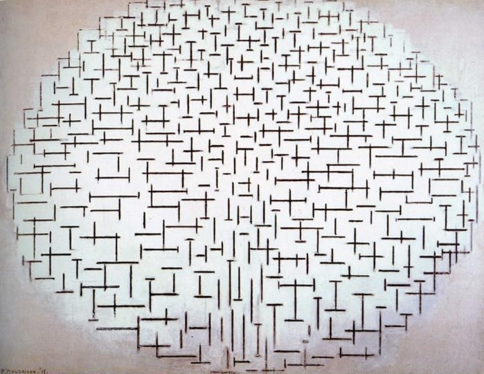
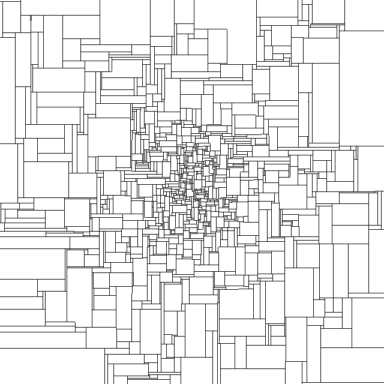
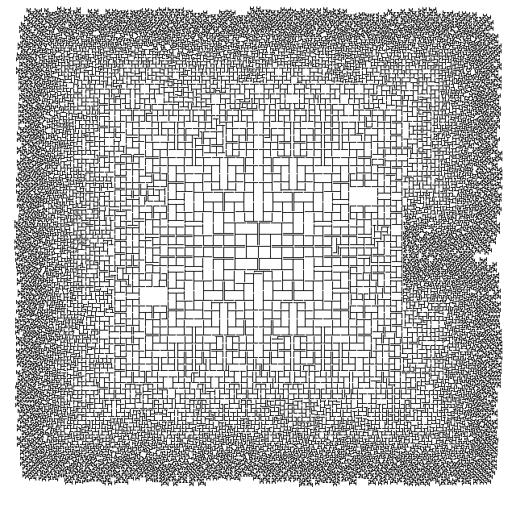
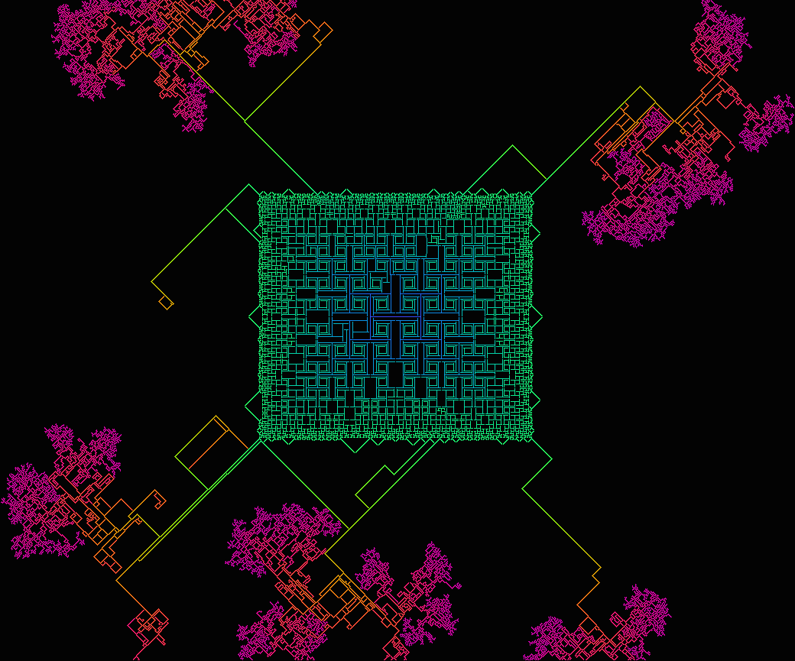

## First inspiration: Mondrian

[Piet Mondrian](http://en.wikipedia.org/wiki/Piet_Mondrian) was a Dutch painter. Today he is most famous for his abstract paintings featuring simple lines, boxes, and primary colors, as part of an artistic movement known as "De Stijl".

But when he first started, his painting style was much more realistic, and only over many years did he gradually begin to emphasize form and order over chaotic reality. Below is one of his early paintings, "Gray Tree".

It's in the middle of this transition that I believe his best paintings were created. The next painting is entitled, "Pier and Ocean", and is the main inspiration behind the algorithm below.

## Second inspiration: Ants on a stick

One of my favorite puzzles is the ants-on-a-stick problem. You have a stick on which you can place as many ants as you want, each ant facing towards one end of the stick or the other. These ants are special: once the timer starts, they move at a constant speed of one stick-length per minute, and at any time, if two ants bump into each other going opposite directions, they both instantaneously turn around and move the opposite direction. When they get to either end of the stick, they fall off.

The question is how to place the ants so as to maximize the amount of time that there is at least one ant on the stick. I won't give the answer here, but I will say that figuring out the answer for yourself is more rewarding than just looking it up. Think about the net effect of two ants bumping into each other.

## Mondriant

While thinking about 2D analogs of the ants-on-a-stick problem, I realized I had stumbled upon a programmatic way of making Mondrian-like designs. I define an ant as being one pixel wide and have it walk in one of the four cardinal directions, leaving a trail. After some amount of time, it can split into two ants traveling at right angles to the original direction.

Complex patterns are created just by tweaking when the splitting happens. I have a random chance for each ant to split during each step, and I also have a deterministic split happen if no random split happens after some preset time. These constants then grow or shrink based on the number of splits that have already happened.

## Examples

## Command Line Interface

I originally coded this up as a command line program in [Rust](http://rust-lang.org). That code is in the CLI folder, and it generates PNG images of either a completed Mondriant simulation or as frames for incorporating into an animation.

## Screensaver

Later a friend convinced me to make it a screensaver. I decided to write it in [Swift](http://developer.apple.com/swift/) for use in Mac OS X 10.10 and later. I added some color and various other features to increase the richness of behavior. Here's a list of the customizable parameters.

| Parameter                 | Explanation                                     |
|---------------------------|-------------------------------------------------|
| Padding                   | How many pixels an ant looks ahead so that it can stop before hitting another ant's trail. |
| Forced split timer        | The number of pixels an ant can travel without splitting before it is forced to split. |
| Forced split timer growth | Each time an ant splits, its offspring's forced split timers are multiplied by this factor when they are created. |
| Forced split timer min    | Forced split timer can never go below this number. |
| Forced split timer max    | Forced split time can never go above this number.
| Random split rate         | The probability, more or less, that an ant will randomly split during each step. This probability is actually scaled so that it cannot split once every step. |
| Random split rate growth  | Each time an ant splits, its offspring's random split rates are multiplied by this factor when they are created. |
| End pause time            | How long the screensaver pauses after the simulation is over. |
